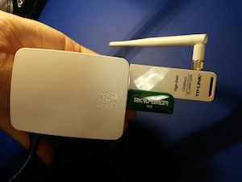

# Build a Raspberry PipeBot  
Here are the basic parts for a PipeBot. Most parts can be swapped out if you know what you are doing. Check out the [Guides](guides.md) for inspiration.
- [Raspberry Pi 2 Model B](http://www.mcmelectronics.com/content/en-US/raspberry-pi)
- [Raspberry Pi Case](http://www.amazon.com/Official-Raspberry-Foundation-Case-Model/dp/B00ZS26ZJA/ref=sr_1_1?ie=UTF8&qid=1444957520&sr=8-1&keywords=Official+raspberry+pi+2+model+b+case)
- [Micro SD Card](http://goo.gl/xXPZuX) with [Pirateship for Pi](http://openpipekit.github.io/pirate.sh/#!index.md)
- [USB Power Supply](http://www.microcenter.com/product/441187/Micro-USB_Power_Supply_for_Raspberry_Pi_B_with_Built-in_4ft_Cable_-_2_Amp)
- [A WiFi USB Dongle if you need it](http://www.microcenter.com/product/361805/150Mbps_Wireless_N_USB_Adapter)
- [USB Flash Drive](http://www.microcenter.com/product/281032/16GB_USB_20_Flash_Drive)

