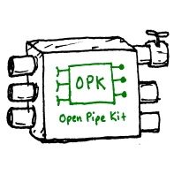

## Join us!
- Join the conversation on this project, [join our email group](https://groups.google.com/forum/#!forum/open-pipe-kit).
- Join us for the weekly OPK check in on Thursdays at 7pm EST. Email rj@rjsteinert.com  with your Gmail address for a Google Hangout invite or your phone number and we'll call you in. Also, if the URL for the Hangout stays the same, it should be accessible [here](https://plus.google.com/hangouts/_/rjsteinert.com).
- See the [OPK Tutorials](https://github.com/openpipekit/opk-tutorials)

## What is the Open Pipe Kit?
The Open Pipe Kit is a number of prototype experiments in the service of lowering the barrier to control and access to the ability of piping data from a sensor to a database. 

## Where do you fit in?

### Are you a non-programmer who wants to pipe data from a sensor to a database?
Check out our collection of Recipes on [RobotKitchen.org](http://robotkitchen.org) for easy to use robot generators that will get you going quickly.

### Do you want to build a robot out of a Raspberry Pi or Arduino in five minutes from the command line?
We built Yeobot, a robot generator that runs on the command line. Look through our list of Recipes, pick one, and then feed it to the Yeobot command. 

### Do you have scripts (like a Gist) that you've built to pipe data from a sensor to a database? 
Follow this 5 minute tutorial to turn that script into a Yeobot Recipe. Next time you use that recipe you'll be able to rebuild and deploy it faster with than editing it by hand. 

### Do you wish the code you wrote to interface with that sensor or database would work with other CLI drivers written in any language?
Consider wrapping that code up as a CLI so that it can interact with other CLI drivers.  See our [CLI Examples](https://github.com/openpipekit/CLI-Examples) to see how to write a CLI driver in your choice of language.

> ./my-sensor-driver/pull | ./any-database-driver/push 

## The Open Pipe Kit Manifesto
Our mission is to develop a kit for building Pipes that ...

1. __Empower non-programmers to collect data from a large selection of sensors__.  Other systems require programming to set up data collection.

2. __Give users multiple data storage options. Fight vendor lock-in by giving users the freedom to choose where their data flows__.  Other proprietary turn-key systems lock users' hardware to one proprietary data service.

3. __Spur innovation by giving programmers the freedom to write additional sensor and database drivers__.  Other systems require users to buy and use their own proprietary sensors and databases.

The Internet has often been compared to a system of pipes.  Imagine that these pipes carry water: for someone interested in collecting water from a local river in order to store it for later use, then, to date, nearly all the "Internet of Things" sensor data solutions are like companies that sell customers proprietary pipes and fittings designed to transport the user's water (sensor data) to a remote, hidden reservoir (a cloud-based server); and typically the user is then required to pay a fee in order to access this now-remote resource. 
 
 We believe it is vital for people in the fields of sensor journalism, environmental monitoring, and agriculture to have full control over the data they collect, and to be able to use reliable, easily-acquired, open source hardware and software that can be modified and repurposed without permission.

 The Open Pipe Kit is a system designed to meet this need, based on a Raspberry Pi and Node.js.  Users of OPK will be able to collect data from sensors and store it either locally (on microSD) or remotely on a server of their own choosing.

## Tutorials
See the [OPK Tutorials](https://github.com/openpipekit/opk-tutorials)
